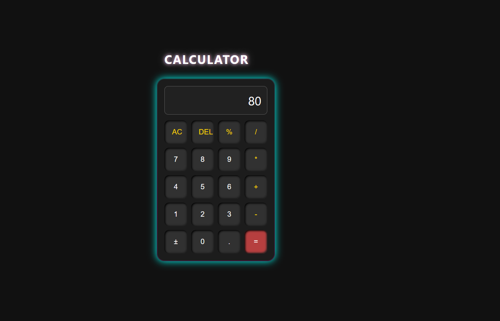

# 🔮 Neon Ring Calculator 🔢

A modern, stylish calculator web app built using **HTML, CSS, and JavaScript**.  
This project includes stunning **rotating neon ring animation**, **responsive layout**, and **interactive sound effects** on button press.

---

## 🧠 Features

- ✅ Clean & modern UI
- 🎨 Animated rainbow border ring
- 🔊 Sound effects on button click
- 🌓 Light-weight and fast
- 🖱️ Hover glow animation
- 🧮 Full arithmetic operations supported

---

## 📸 Preview

  
*(Add your screenshot here and rename it `preview.png`)*

---

## 🚀 How to Run

1. Clone this repository  
   ```bash
   git clone https://github.com/your-username/neon-ring-calculator.git
   cd neon-ring-calculator
